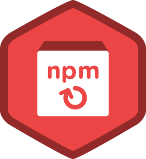

# timeCourses-JS

Check time of the course - vanilla JS (in progress)

<br>

## 🎥 Preview site :arrow_right: [tap here](https://szymonrojek.github.io/timeCourses-JS/)

<br>
<br>

<!--  -->

<br>
<br>

## Description:

---

<br>

```js
...
```

<br>

## Technologies:

---

<br>
<br>

<table>
  <tr>
    <td></td>
    <td></td>
    <td></td>
    <td></td>
  </tr>
</table>
<table>
  <tr>
    <td></td>
    <td> </td>
    <td></td>
  </tr>
 </table>

<br>

## I have used:

<br>

---

- Semantic HTML
- BEM methodology
- RWD

<br>

## Usage:

---

<br>

1. Install project:

```
npm install to have dev dependencies installed.
```

2. To start development and server for live preview

```
npm run dev
```

3. Build version

```
npm run build
```

4. Dist version - gh-pages

```
npm run deploy
```
